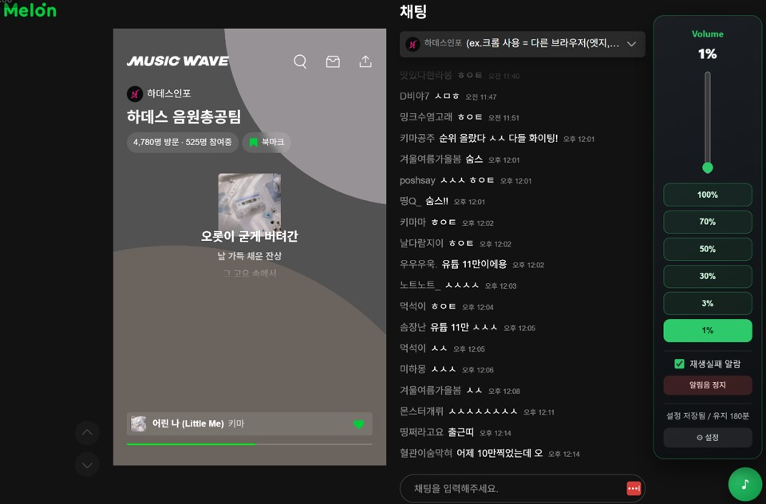
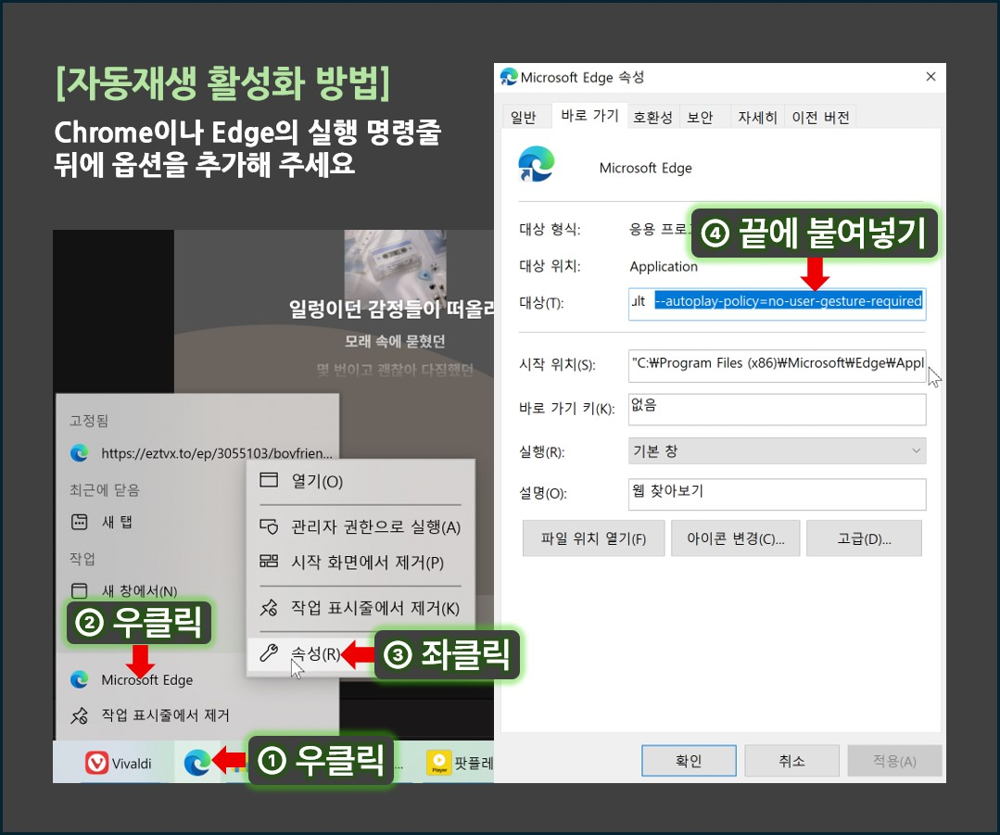
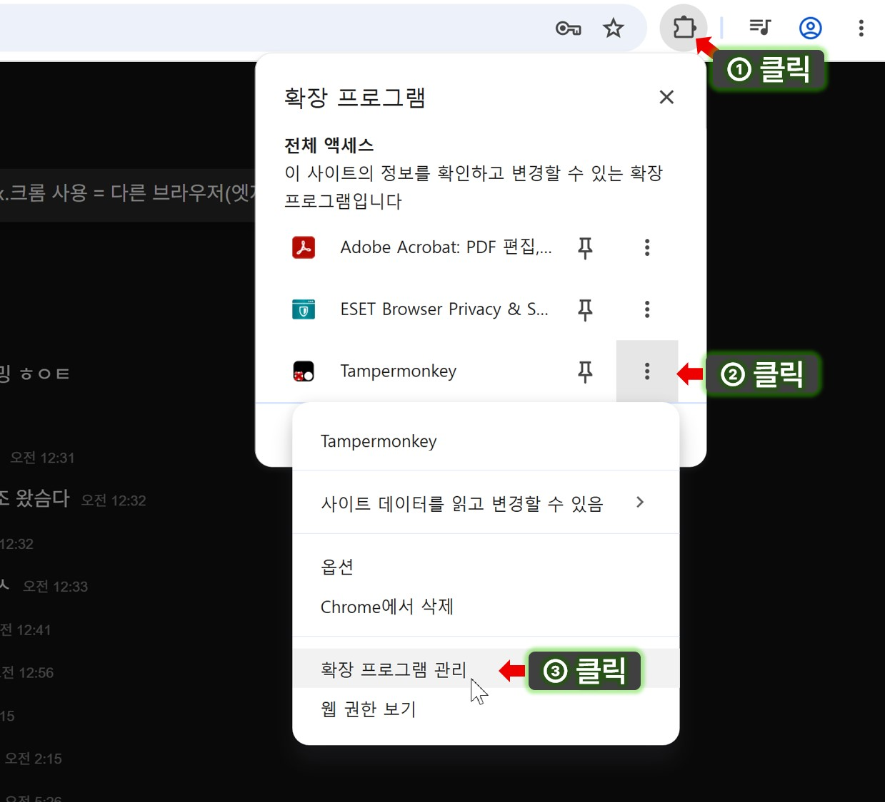
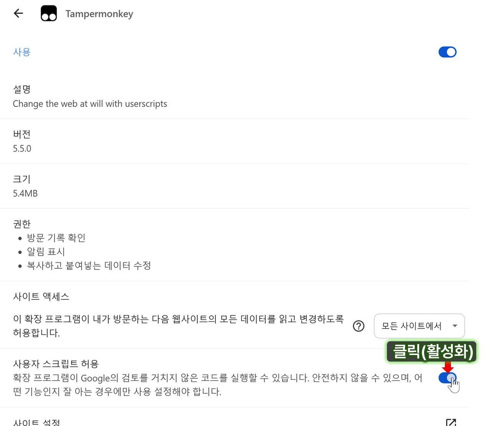
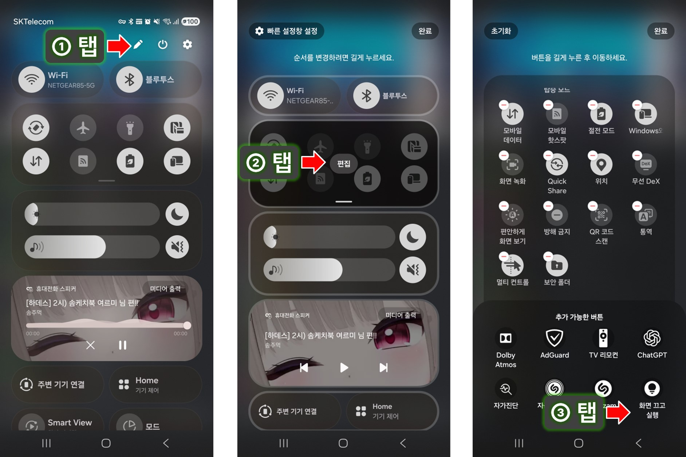
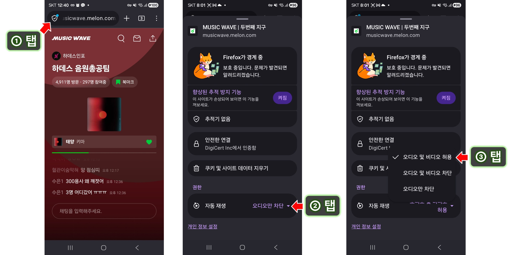

# 멜론 뮤직웨이브 플러스



✔ **볼륨조절**  : 볼륨 슬라이드바 생성 & 프리셋 버튼  `1%`, `3%`, `10%`, `50%`, `70%`, `100%`

✔ **재생중지 알림**  : 음악 재생이 5초 이상 멈추면 알림음 재생

✔ **튕김방지**  : 인터넷 오류 시 정상화될 때까지 대기 & 새로고침

✔ **재생멈춤 방지**  : 봉준 카페 **건빵** 이상 인증 후 기능 활성화

✔ **모바일 환경 지원**


※ 볼륨 조절과 알림 기능은 GreasyFork에 올라와 있는 베리아가님 스크립트 아이디어를 참고했습니다.

##

<br>
<br>


### 📢 제작자 코멘트

**✔ 새 기능(v2.8.0)** : 모바일 환경 지원 👇🏻 [모바일 환경 설치 바로가기](#faq--참고-사항)

**✔ 새 기능 v2.6.1** : 튕김 방지 🛡
스밍하다가 재생멈춤이 아니라 멜론 서버 문제로 오류나고 튕기길래, 그거 막는 기능도 넣어 봤습니다.
인터넷 연결 문제가 생겨도 오류 화면 뜨지 않고 대기하다가 정상화 되면 새로고침 됩니다.
즉, 연결 문제로 튕기지 않습니다. (하지만 아직 테스트 중인 기능입니다.)

**✔ 재생멈춤 방지 기능**은 이전 버전(v2.5.0)에서 60시간 연속 노터치 재생 테스트 되었습니다.
하지만, 언제라도 예외상황은 있을 수 있습니다. 혹시 안되는 경우를 알려주시면 쓸만해 질 때 까지 고쳐 볼게요.

**✔ 자동업데이트**
2.8.0. 버전 부터 자동업데이트 됩니다.

<br><br>

### ⛔ 주의사항
1. 일부 기능은 봉준-하데스 카페 '건빵' 이상만 사용할 수 있습니다.
2. 이 스크립트는 제작자 허락없이 외부 배포를 엄히 금합니다.
3. 관리 목적으로 hash값 등을 외부 서버에 전송합니다만, 개인을 특정할 수 있는 정보나 PC정보는 전송하지 않습니다.

##

<br><br>


# 📑 설치방법

<br>

## 1. 데스크탑 환경 (크롬 계열)

### 1-1. 브라우저 자동재생 허용

브라우저 명령줄에 아래 옵션을 추가하세요.

```bash
--autoplay-policy=no-user-gesture-required
```




명령줄을 추가한 뒤에는 브라우저를 모두 종료하고, 새로 만든 아이콘 또는 바로가기로 실행해야 합니다.

※ 모든 사이트에서 자동재생이 되면 불편할 수도 있으니, 스밍용 브라우저를 따로 설치하는 것을 추천합니다.

<br>


### 1-2. Tampermonkey 설치

엣지 또는 크롬 확장프로그램에서 Tampermonkey를 설치합니다.

### 크롬용

[Chrome 웹 스토어 - Tampermonkey](https://chromewebstore.google.com/detail/tampermonkey/dhdgffkkebhmkfjojejmpbldmpobfkfo?hl=ko)
https://chromewebstore.google.com/detail/tampermonkey/dhdgffkkebhmkfjojejmpbldmpobfkfo?hl=ko

### 엣지용

[Microsoft Edge Add-ons - Tampermonkey](https://microsoftedge.microsoft.com/addons/detail/tampermonkey/iikmkjmpaadaobahmlepeloendndfphd)
https://microsoftedge.microsoft.com/addons/detail/tampermonkey/iikmkjmpaadaobahmlepeloendndfphd

<br>

### 1-3. Tampermonkey 권한 허용

크롬 최신버전에서는 아래와 같이 권한을 활성화해 줘야 합니다.
엣지나 다른 브라우저에서는 아직 이런 설정을 요구하지는 않습니다만, 언젠가 생길 수도 있습니다.

<br>

### 1) 확장프로그램 설정창 진입


<br>

### 2) 필요 권한 활성화



##

<br>

### 1-4. 스크립트 설치

아래 링크를 클릭하여 스크립트를 설치합니다.

[melon_musicwave_helper.user.js](https://gistcdn.githack.com/brightwoods/8f89bcc1845a365da50f0c52d882efab/raw/melon_musicwave_helper.user.js)
https://gistcdn.githack.com/brightwoods/8f89bcc1845a365da50f0c52d882efab/raw/melon_musicwave_helper.user.js

Tampermonkey가 설치된 상태에서 위 링크를 클릭하면 스크립트 설치 화면이 나오고, 설치를 누르면 끝입니다.

이전 버전을 설치하신 분들은 위 링크를 열면 바로 재설치가 가능합니다.

##

<br><br>

## 2. 모바일 환경 설치

모바일 기기는 실제로 기기를 끄거나 절전 시키면 스밍도 중단 되기 때문에 끄면 안됩니다.

그 대신, OLED 디스플레이 수명을 보존하기 위해 화면을 검게 해주는 앱을 사용합니다.

<br>

## Android (Firefox 활용)

### 2-0. 블랙스크린 앱 설치

실제로는 화면을 끄지 않고 검은 화면을 출력하는 앱 입니다.

✔ Google Play 스토어에서 "화면 끄고 실행" 검색해서 설치

✔ 스마트폰 상단 설정패널을 열고 '편집' 버튼 누름

✔ 단축메뉴 편집 버튼 누름

✔ 화면 끄고 실행 추가, '완료'버튼 누름

※ 갤럭시 기준 설명입니다.



<br>

### 2-1. Firefox 설치

✔ Google Play 스토어에서 Firefox 설치.

✔ Firefox 권한 중에 '알림' 권한은 반드시 허용해 주셔야 합니다.

<br>

### 2-2. 뮤직웨이브 자동재생 허용

✔ 뮤직웨이브 접속
뮤직웨이브 주소를 주소창에 직접 붙여넣기 해 주세요. (단축 주소로 접속하면 멜론 앱에서 실행하라고 뜹니다.)
https://musicwave.melon.com/musicwave.htm?m=XpW5tWALVNEUad5EpkFj2A

✔ 사이트 설정 → 자동 재생 → "오디오 및 비디오 허용" 선택.


<br>

### 2-3. Firefox 확장 Tampermonkey 설치

Firefox에서 아래 주소로 가서 Tampermonkey를 설치합니다.

https://addons.mozilla.org/ko/android/addon/tampermonkey/

<br>

### 2-4. 스크립트 설치

https://gistcdn.githack.com/brightwoods/8f89bcc1845a365da50f0c52d882efab/raw/melon_musicwave_helper.user.js

스크립트 주소 열기 → Tampermonkey 설치 화면에서 "설치" 탭.

<br>

### 2-5. 화면 끄고 스밍하기

✔ 로그인 하고, 카페 인증도 해서 무인 스밍을 시작하세요. (아래 3. 사용방법 참조)

✔ 아까 상단 빠른실행에 추가한 "화면 끄고 실행" 버튼을 누르세요.

▶ 스밍이 계속 되면서 검은화면만 출력 됩니다.

<br>

##

<br>

## iOS (Safari 브라우저)

이 기능은 AI도움으로 어찌저찌 구현했으나, 주변에 아이폰 쓰는 사람이 없어서 전혀 테스트되지 않았습니다.

아래 설명에 스샷 조차 없습니다. AI 설명으로 대신합니다.

<br>

### 2-0. iOS 제한사항

iOS는 시스템 제약이 많아 안드로이드보다 기능이 제한됩니다. 아래 내용을 먼저 이해하고 진행하세요.

• 볼륨 조절과 재생실패 알람은 지원되지 않습니다.

• 화면을 끄면 재생이 멈춥니다.

무인 재생 시에는 반드시 설정 → 디스플레이 및 밝기 → 자동 잠금 → "안 함"으로 설정하세요.

• iOS의 다른 브라우저는 지원하지 않으며, 오직 Safari + Userscripts 앱 조합에서만 동작합니다.

• 최초 페이지를 연 뒤 화면을 한 번 탭해야 재생이 시작됩니다.

• 무인 스밍 전용기 용도로는 안드로이드 기기를 권장합니다. iOS는 위 제약으로 인해 안정성이 떨어집니다.

<br>

### 2-1. 앱 설치 (Userscripts)

• App Store에서 "Userscripts"를 검색해 설치합니다 <br> (무료, 퍼즐 모양 아이콘, 제작자 Justin Wasack).

• 설치 후 앱을 한 번 실행하고 "Set Userscripts Directory"를 눌러, 파일 앱에서 빈 폴더를 하나 만들어 선택합니다. <br> 이 단계를 건너뛰면 앱이 동작하지 않으니 반드시 진행하세요.

<br>

### 2-2. Safari 확장프로그램 활성화

• 설정 앱 → Safari → 확장 프로그램 → Userscripts를 켭니다.

• 이어서 같은 화면에서 Userscripts를 탭해 권한을 "허용"으로 바꾸고, "모든 웹사이트"에 대한 접근을 허용합니다. <br> (웹사이트별 권한 대신 전체 허용을 권장). 권한을 안 주면 스크립트가 페이지에 주입되지 않습니다.

<br>

### 2-3. 스크립트 설치

• Safari로 스크립트 주소를 엽니다. 코드가 화면에 표시됩니다.

https://gistcdn.githack.com/brightwoods/8f89bcc1845a365da50f0c52d882efab/raw/melon_musicwave_helper.user.js

• 주소창 왼쪽(또는 하단 도구막대)의 확장 아이콘 "ﾑ"를 탭 → Userscripts를 선택하면 "Tap to Install" 안내가 뜹니다. <br> 이를 탭한 뒤, 나오는 스크립트 정보 화면을 아래로 스크롤해 "Install"을 누릅니다.

• 설치 후 멜론 뮤직웨이브 페이지를 열고, 화면에 "▶"이 뜨면 한 번 탭해 재생을 시작합니다.

• 유의사항. 처음 방문하는 사이트에서는 2-2의 권한 부여를 다시 요구할 수 있습니다. <br> 그럴 때는 확장 아이콘에서 권한을 허용하고 페이지를 새로고침하세요. <br> 스크립트가 활성 상태인지는 Userscripts 메뉴에서 스크립트 이름이 강조 표시되는지로 확인할 수 있습니다.


##

<br><br>

### 3. 사용방법

**✔ 볼륨조절**

우측 하단 아이콘을 클릭하면 볼륨 조절 바가 나옵니다.

볼륨은 기본 `1%`로 설정되어 있습니다.

**✔ 재생중지 알림**

음악 재생이 5초 이상 멈추면 알림음이 재생됩니다.

**✔ 기능 제한 해제**

이 스크릅트의 일부 기능을 사용하려면 카페회원 인증을 해야 합니다.
카페 인증이 안 된 경우 `인증 필요 (기능제한)` 이라는 버튼이 나타납니다.
`인증 필요 (기능제한)` 를 누르면 자동으로 카페 접속창이 열리고 회원등급 확인을 합니다.

```
